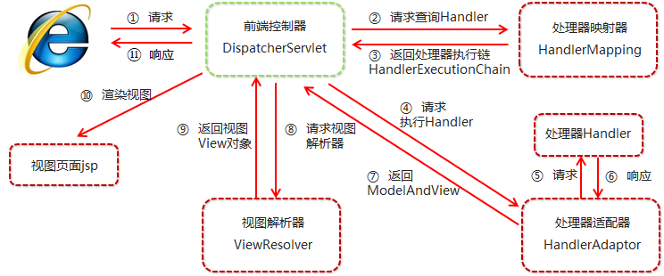

## springMVC模块的核心对象
1. DispatcherServlet（核心控制器）
>用户请求到达前端控制器，它就相当于mvc模式中的c，DispatcherServlet是整个流程控制的中心，由它调用其它组件处理用户的请求，DispatcherServlet的存在降低了组件之间的耦合性。

2. HandlerMapping（映射器处理器）
>HandlerMapping负责根据用户请求找到Handler即处理器，springmvc提供了不同的映射器实现不同的映射方式，例如：配置文件方式，实现接口方式，注解方式等。

3. HandlerAdapter (处理器适配器)
>通过HandlerAdapter对处理器进行执行，这是适配器模式的应用，通过扩展适配器可以对更多类型的处理器进行执行。

4. Handler（Controller）后端处理器
>Handler是继DispatcherServlet前端控制器的后端控制器，在DispatcherServlet的控制下Handler对具体的用户请求进行处理。由于Handler涉及到具体的用户业务请求，所以一般情况需要程序员根据业务需求开发Handler。

5. ViewResolve（视图解析器）
>ViewResolver负责将处理结果生成View视图，ViewResolver首先根据逻辑视图名解析成物理视图名即具体的页面地址，再生成View视图对象，最后对View进行渲染将处理结果通过页面展示给用户。

6. View(视图)
>SpringMVC框架提供了很多的View视图类型的支持，包括：jstlView、freemarkerView、pdfView等。我们最常用的视图就是jsp。一般情况下需要通过页面标签或页面模版技术将模型数据通过页面展示给用户，需要由程序员根据业务需求开发具体的页面

---

## 处理流程

1. 用户发送请求至前端控制器DispatcherServlet。

1. DispatcherServlet收到请求调用HandlerMapping处理器映射器。

1. 处理器映射器根据请求url找到具体的处理器，生成处理器对象及处理器拦截器(如果有则生成)一并返回给DispatcherServlet。

1. DispatcherServlet通过HandlerAdapter处理器适配器调用处理器。

1. 执行处理器(Controller，也叫后端控制器)。

1. Controller执行完成返回ModelAndView。

1. HandlerAdapter将controller执行结果ModelAndView返回给DispatcherServlet。

1. DispatcherServlet将ModelAndView传给ViewReslover视图解析器。

1. ViewResolver解析后返回具体View。

1. DispatcherServlet对View进行渲染视图（即将模型数据填充至视图中）。

1. DispatcherServlet响应用户。
